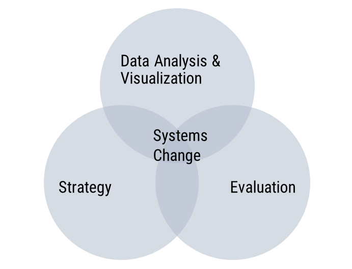

So, I got into data and evaluation by chance. That tends to be the journey for most evaluators. Though there are now a handful of dedicated program evaluation graduate degrees--some even offer data analytics courses--most evaluators have diverse backgrounds, training, and education. 

I graduated from the University of Texas Rio Grande Valley in 2016 with a Masters in Public Administration and took a few courses on program evaluation, statistics, research methods, and grant writing. Evaluation was kept coming up, and it drew my attention due to the logical framework it follows, and the variety of skills you need to employ--qualitative and quantitative research methods, statistics, data analysis, data visualization, writing, planning, communication, etc.

In my mind, if I followed the logic model framework and mastered some of these skills, I would be ready to evaluate any program, project, or business. The reality was totally different, and it took me several years to realize that.

My view of evaluation has evolved since those days. I see data analysis & visualization, evaluation, and strategic planning and decision-making as tools that help me operate and create value within a larger context that seeks to drive systems change.

